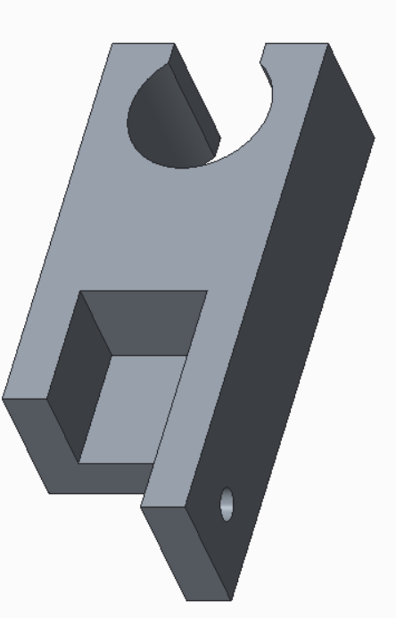
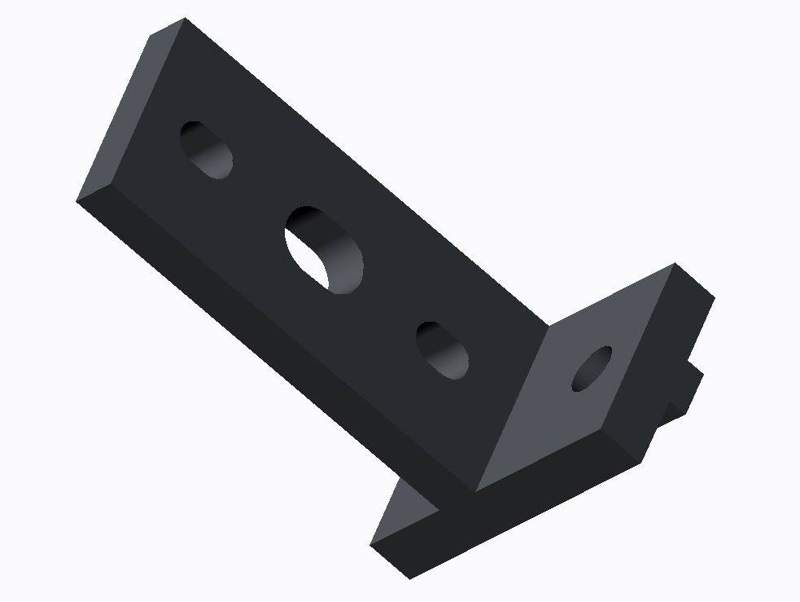
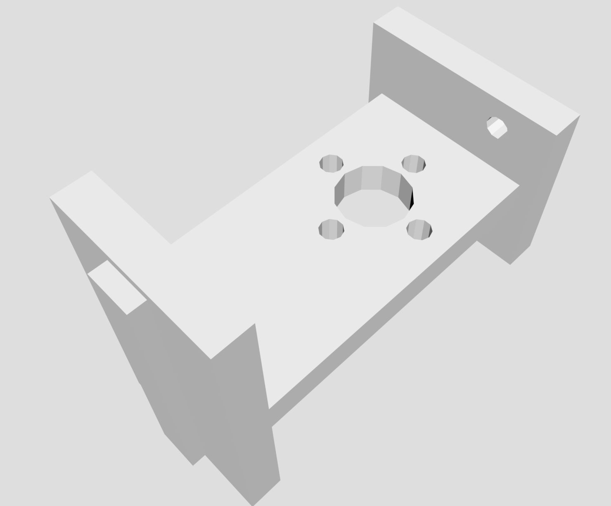
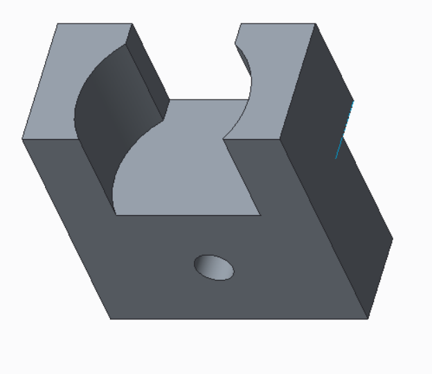

### Overview

This project was created for an assignment to build a 2.5 DOF electromechanical system in an introduction to design course. My role in this project was to design and manufacture all mounts, and to select actuators.

<iframe width="420" height="315"
src="http://www.youtube.com/embed/SPWHj9GLalQ">
</iframe>

### Development
In feedback from potential customers, price and reliability were favored over speed. Dots needed to be uniform in height, shape, and distance apart to be legible. To achieve this, I implemented a solenoid that traveled along the horizontal axis of the sheet via a lead screw, and a paper-feeding slot car tire. This feed design was intended to function similarly to that of a standard inkjet printer.





```
CAD models of motor and actuator mounts
```
</br></br>
All mounts were 3D printed, while the paper feed axle and motor couplings were manufactured on a lathe.
